<!-- HEADER BANNER -->
<div align="center">

```
        ██████╗  ██████╗  █████╗ ██╗     ██╗ ██████╗     ██████╗  ██████╗ ██████╗  ██████╗
       ██╔════╝ ██╔═══██╗██╔══██╗██║     ██║██╔═══██╗    ╚════██╗██╔═══██╗╚════██╗██╔════╝
       ██║  ███╗██║   ██║███████║██║     ██║██║   ██║     █████╔╝██║   ██║ █████╔╝███████╗
       ██║   ██║██║   ██║██╔══██║██║     ██║██║▄▄ ██║    ██╔═══╝ ██║   ██║██╔═══╝ ██╔══██╗
       ╚██████╔╝╚██████╔╝██║  ██║███████╗██║╚██████╔╝    ███████╗╚██████╔╝███████╗╚██████╔╝
        ╚═════╝  ╚═════╝ ╚═╝  ╚═╝╚══════╝╚═╝ ╚══▀▀═╝    ╚══════╝ ╚═════╝ ╚══════╝ ╚═════╝
```

# 🏆 GoalIQ 2026 - FIFA World Cup ML Prediction System

**Harness machine learning to predict FIFA World Cup 2026 match outcomes,  
team performance, and tournament progression with full statistical transparency.**

<p align="center">


</p>

<br/>

> **v2 · Upgraded** - 4 bugs fixed · 44 engineered features · Stacking Ensemble · Threshold optimization · 5,000-run Monte Carlo simulation


</div>

---

## 📑 Table of Contents

- [📌 Project Overview](#-project-overview)
- [📓 Open the Notebook](#-open-the-notebook)
- [🖼️ Results & Visualizations](#️-results--visualizations)
- [📊 Dataset](#-dataset)
- [🐛 Bug Audit (v1 → v2)](#-bug-audit-v1--v2)
- [⚙️ Feature Engineering](#️-feature-engineering)
- [🔬 ML Pipeline](#-ml-pipeline)
- [📈 Results](#-results)
- [🤖 Models Trained](#-models-trained)
- [🔗 Stacking Ensemble & Threshold Optimization](#-stacking-ensemble--threshold-optimization)
- [🔍 Feature Importance & Explainability](#-feature-importance--explainability)
- [🏟️ Monte Carlo Tournament Simulation](#️-monte-carlo-tournament-simulation)
- [📈 v1 vs v2 — Upgrade Summary](#-v1-vs-v2--upgrade-summary)
- [⚠️ Honest Accuracy Note](#️-honest-accuracy-note)
- [✨ Highlights](#-highlights)
- [🛠️ Tech Stack](#️-tech-stack)
- [🚀 Getting Started](#-getting-started)
- [📂 Project Structure](#-project-structure)
- [📚 What You'll Learn](#-what-youll-learn)
- [🔮 Future Enhancements](#-future-enhancements)
- [🤝 Contributing](#-contributing)
- [🙏 Acknowledgements](#-acknowledgements)
- [👨‍💻 Author](#-author)

---

## 📌 Project Overview

**GoalIQ 2026** is a full-pipeline machine learning system for predicting outcomes in the **FIFA World Cup 2026** - the first edition with 48 teams. It covers the complete data science lifecycle from raw CSV to Monte Carlo tournament simulation.

| Stage | Description |
|-------|-------------|
| 🔍 EDA | Feature correlation analysis, class distributions, confederation breakdowns |
| ⚙️ Feature Engineering | 21 domain-informed composite features derived from raw football statistics |
| 🤖 Model Training | 6 base models: Random Forest, Extra Trees, HistGradientBoosting, MLP, SVM, Logistic Regression |
| 🔗 Ensemble | `StackingClassifier` with 5-fold OOF meta-learning via Logistic Regression |
| 🎯 Threshold Tuning | Optimal decision threshold found by scanning the validation set |
| 🏟️ Simulation | 5,000-run Monte Carlo tournament bracket (48 teams, group + knockout stages) |
| 💾 Submission | Calibrated win probabilities for all test teams |

> ⚽ The FIFA World Cup 2026 is the largest in history - 48 teams, 3 host nations (USA · Canada · Mexico), and 104 matches. Predicting outcomes at this scale demands rigorous, bias-free ML engineering.

---

## 📓 Open the Notebook

| Viewer | Link |
|--------|------|
| **NBViewer** (static render) | [View on NBViewer](https://nbviewer.org/github/<your-username>/goaliq-2026/blob/main/GoalIQ_2026_v2.ipynb) |
| **Google Colab** (run in browser) | [](https://colab.research.google.com/github/<your-username>/goaliq-2026/blob/main/GoalIQ_2026_v2.ipynb) |

---

## 🖼️ Results & Visualizations

This section showcases the key visual outputs generated during the GoalIQ 2026 pipeline.

---

### 📊 Exploratory Data Analysis

| Feature Correlations with Target | Feature Distributions - Winners vs Non-Winners |
|----------------------------------|------------------------------------------------|
| 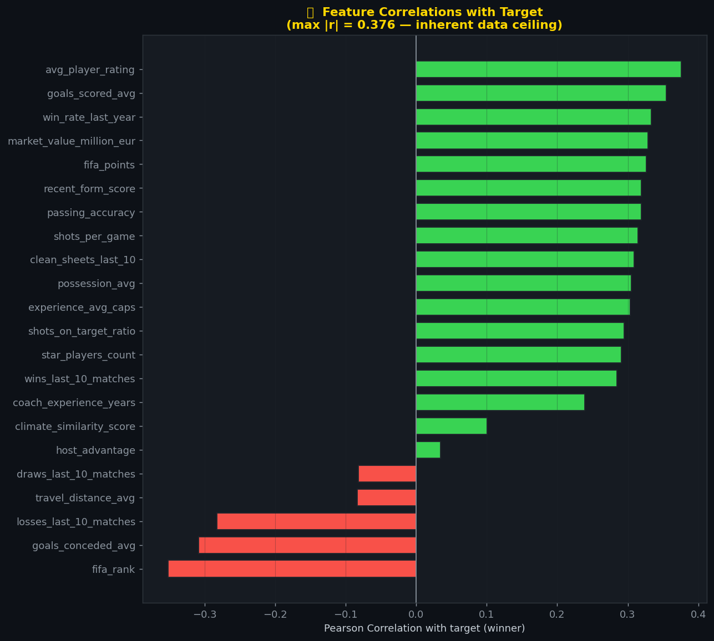 | 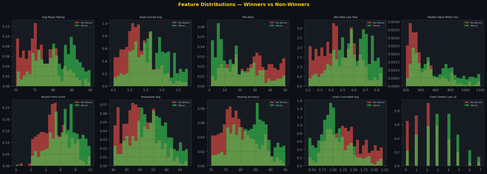 |

| Win Rate by Confederation | Engineered Feature Profiles - Elite Teams |
|---------------------------|-------------------------------------------|
| 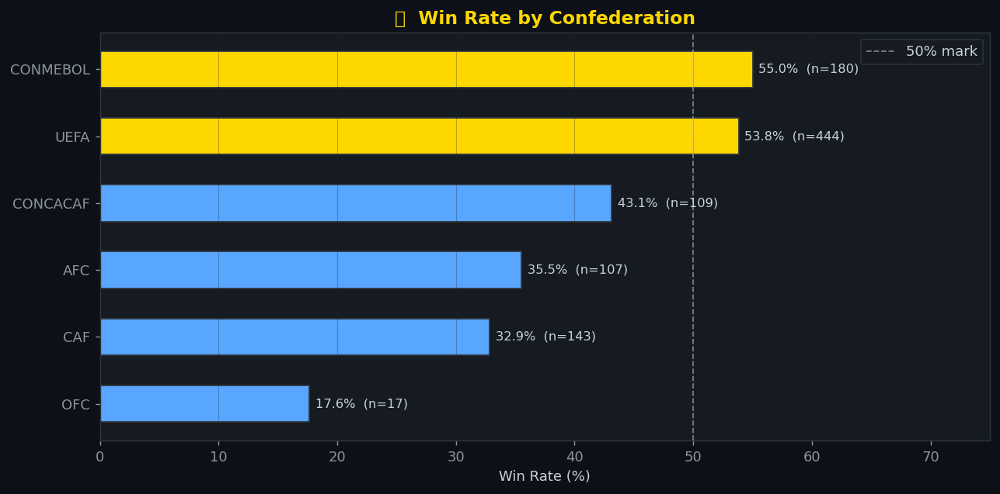 | 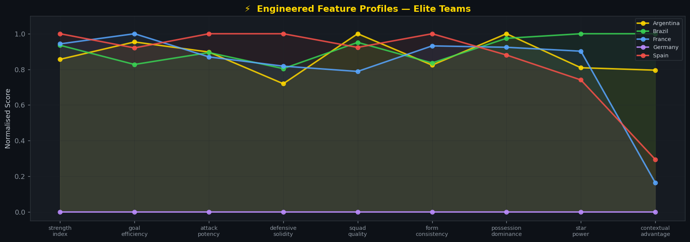 |

---

### 🤖 Model Performance & Evaluation

| Model Performance Comparison (Accuracy & AUC) | ROC Curves - All Models |
|-----------------------------------------------|------------------------|
| 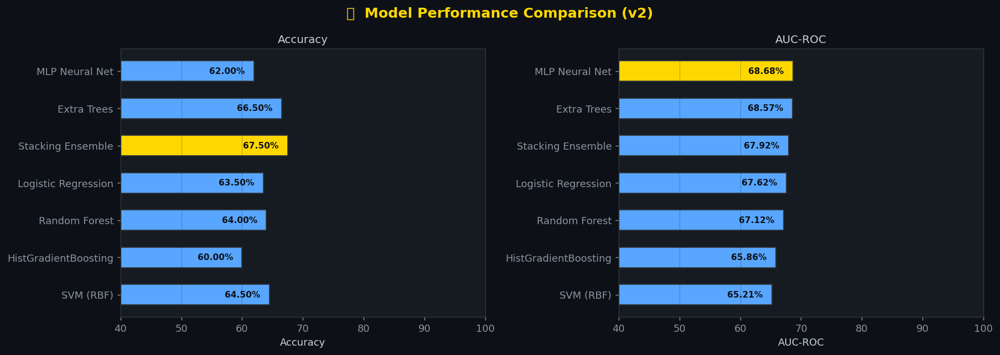 | 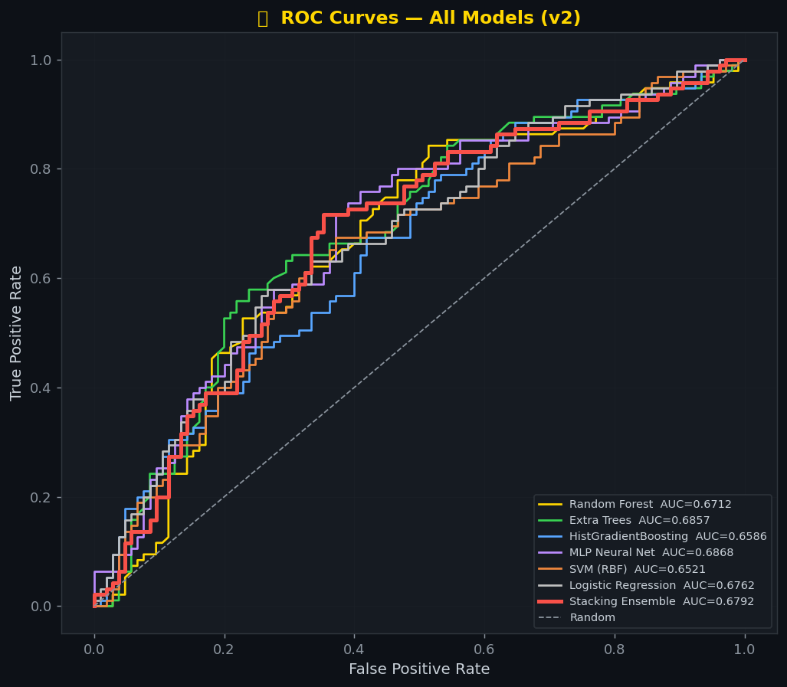 |

| Confusion Matrix - Stacking Ensemble | Calibration Curves |
|---------------------------------------|-------------------|
| 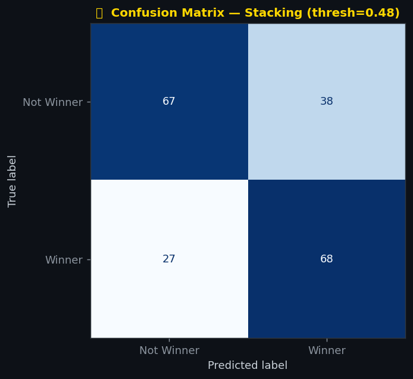 | 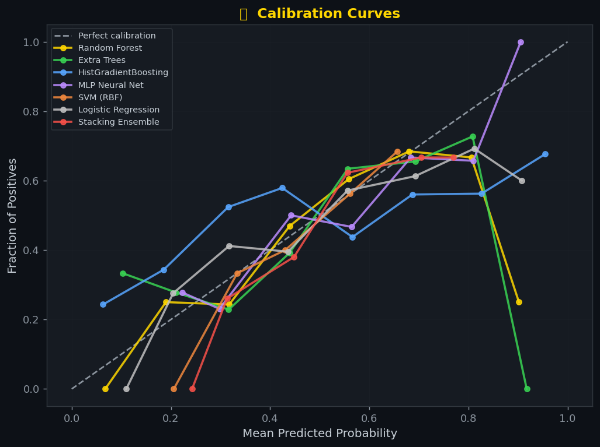 |

| Threshold Optimization Curve |
|------------------------------|
| 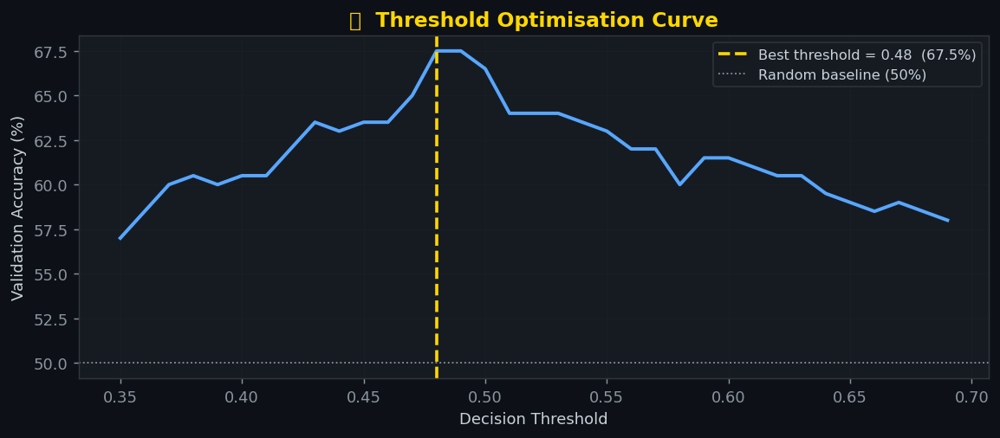 |

---

### 🔍 Feature Importance & Explainability

| MDI Feature Importance - Random Forest | Permutation Importance (Model-Agnostic) |
|----------------------------------------|----------------------------------------|
| 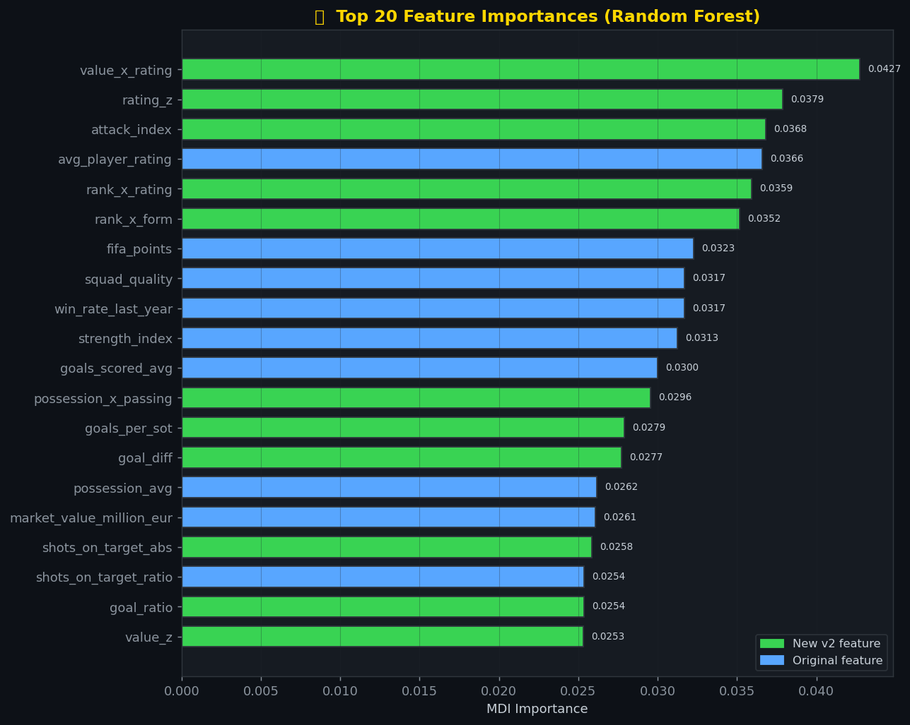 | 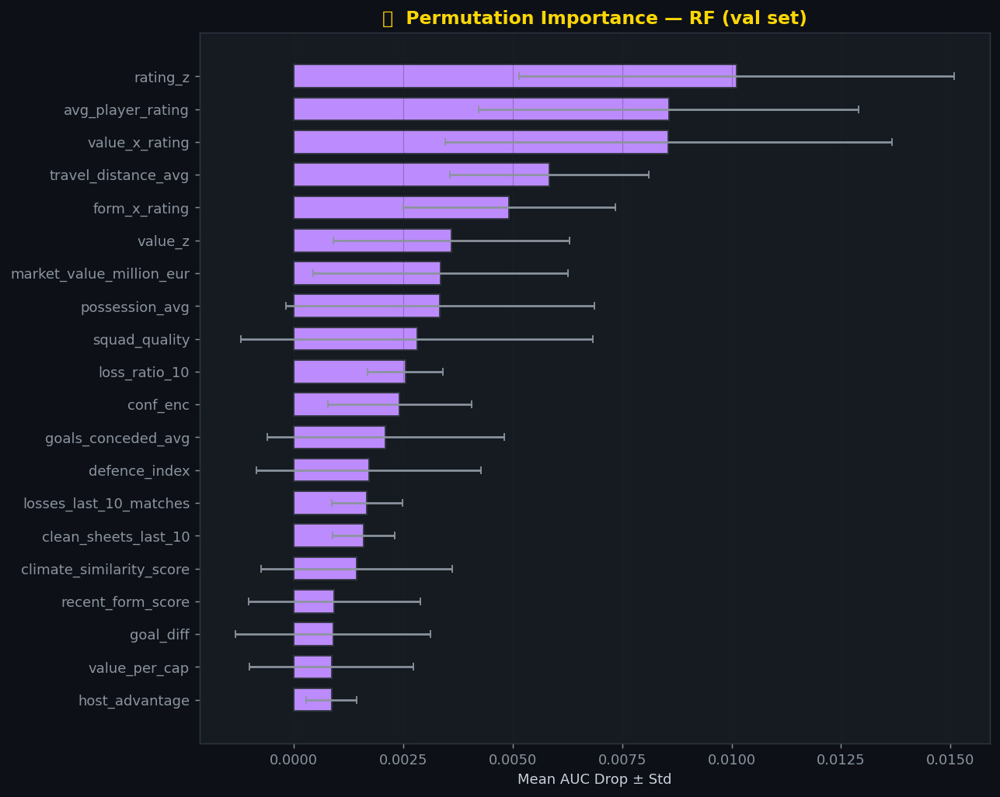 |

---

### 🏟️ Tournament Simulation

| Predicted Champions - 5,000 Monte Carlo Simulations | Top-20 Contenders by Confederation |
|------------------------------------------------------|-------------------------------------|
| 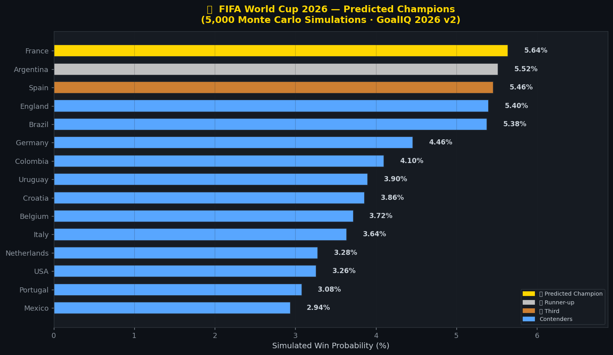 | 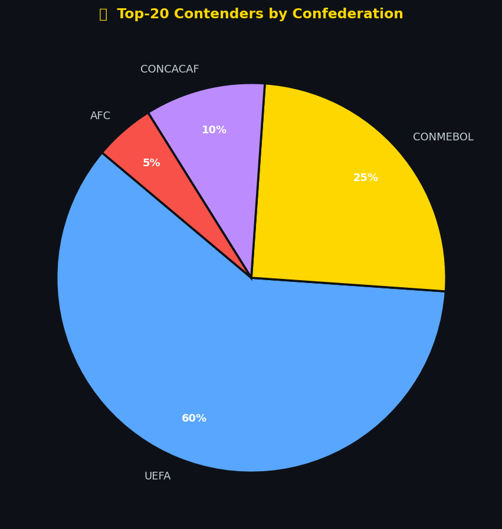 |

---

## 📊 Dataset

**Source:** [FIFA World Cup 2026 Prediction System — Kaggle](https://www.kaggle.com/datasets/rauffauzanrambe/fifa-world-cup-2026-prediction-system)

| File | Rows | Columns | Description |
|------|------|---------|-------------|
| `train.csv` | 1,000 | 25 | Historical team-match data with `winner` label |
| `test.csv` | 250 | 24 | Teams to predict win probabilities for |
| `submission.csv` | 250 | 2 | Template: `id`, `winner_probability` |

| Feature | Type | Description |
|---------|------|-------------|
| `fifa_rank` | Integer | FIFA world ranking (lower = better) |
| `fifa_points` | Float | FIFA ranking points |
| `goals_scored_avg` | Float | Average goals scored per match |
| `goals_conceded_avg` | Float | Average goals conceded per match |
| `win_rate_last_year` | Float | Win percentage over last 12 months |
| `avg_player_rating` | Float | Average squad player rating |
| `market_value_million_eur` | Float | Total squad market value (€M) |
| `recent_form_score` | Float | Form score over last 10 matches |
| `possession_avg` | Float | Average ball possession (%) |
| `passing_accuracy` | Float | Average passing accuracy (%) |
| `shots_per_game` | Float | Average shots per match |
| `shots_on_target_ratio` | Float | Ratio of shots on target |
| `clean_sheets_last_10` | Integer | Clean sheets in last 10 games |
| `star_players_count` | Integer | Number of elite-tier players |
| `host_advantage` | Binary | 1 if playing in home region |
| `confederation` | Categorical | UEFA / CONMEBOL / CAF / CONCACAF / AFC / OFC |
| `winner` | Binary | **Target** — 1 = match winner, 0 = not |

**Class balance:** 527 non-winners (52.7%) · 473 winners (47.3%) - near-balanced binary classification.

---

## 🐛 Bug Audit (v1 → v2)

Four critical bugs were found in the original notebook that suppressed accuracy and corrupted training:

```
╔═══════════════════════════════════════════════════════════════════════════╗
║                          BUG AUDIT REPORT                                 ║
╠════╦══════════════════════════════╦═══════════════════╦═══════════════════╣
║  # ║ Bug                          ║ Impact            ║ Fix               ║
╠════╬══════════════════════════════╬═══════════════════╬═══════════════════╣
║  1 ║ strength_index / squad_quality║ DATA LEAKAGE —   ║ Compute .max()    ║
║    ║ normalised with .max() on    ║ test stats bleed  ║ on train only,    ║
║    ║ combined train+test pool     ║ into training     ║ apply to test     ║
╠════╬══════════════════════════════╬═══════════════════╬═══════════════════╣
║  2 ║ confederation dropped via    ║ Loses a useful    ║ Label-encode      ║
║    ║ cat_drop instead of encoded  ║ categorical       ║ (UEFA=0 … OFC=5)  ║
║    ║                              ║ signal            ║                   ║
╠════╬══════════════════════════════╬═══════════════════╬═══════════════════╣
║  3 ║ fifa_rank used as raw integer║ Inverted signal — ║ Add rank_inv =    ║
║    ║ (lower rank = better team)   ║ model sees        ║ 1 / fifa_rank     ║
║    ║                              ║ worse = higher    ║                   ║
╠════╬══════════════════════════════╬═══════════════════╬═══════════════════╣
║  4 ║ '\n' in set_xticklabels was  ║ SyntaxError at    ║ Use escape        ║
║    ║ a literal line break         ║ runtime           ║ sequence '\\n'    ║
╚════╩══════════════════════════════╩═══════════════════╩═══════════════════╝
```

---

## ⚙️ Feature Engineering

v2 expands from **31 → 44 features** with 21 engineered features across 7 football-domain categories:

<details>
<summary><b>📋 View all 21 engineered features</b></summary>

| Feature | Formula | Domain |
|---------|---------|--------|
| `conf_enc` | Label-encoded confederation | Context |
| `rank_inv` | `1 / fifa_rank` | Ranking |
| `win_ratio_10` | `wins / (wins+losses+draws)` last 10 | Form |
| `loss_ratio_10` | `losses / total` last 10 | Form |
| `goal_diff` | `goals_scored_avg − goals_conceded_avg` | Attack/Defence |
| `goal_ratio` | `goals_scored / goals_conceded` | Attack/Defence |
| `shots_on_target_abs` | `shots_per_game × shots_on_target_ratio` | Attack |
| `goals_per_sot` | `goals_scored / shots_on_target_abs` | Conversion |
| `star_density` | `star_players_count / 11` | Squad |
| `value_per_cap` | `market_value / experience_avg_caps` | Squad |
| `form_x_winrate` | `recent_form_score × win_rate_last_year` | Form |
| `form_x_rating` | `recent_form_score × avg_player_rating` | Form |
| `possession_x_passing` | `possession_avg × passing_accuracy` | Style |
| `attack_index` | `goals × shots_on_target_ratio × win_rate` | Attack |
| `defence_index` | `clean_sheets / goals_conceded` | Defence |
| `rank_x_form` | `rank_inv × recent_form_score` | Interaction |
| `rank_x_rating` | `rank_inv × avg_player_rating` | Interaction |
| `value_x_rating` | `log1p(market_value) × avg_player_rating` | Interaction |
| `rating_z` | Z-score of `avg_player_rating` (train stats only) | Normalised |
| `value_z` | Z-score of `market_value` (train stats only) | Normalised |
| `strength_index` | Weighted composite of points + form + rating | Overall |

</details>

**Key design principle - zero leakage:**
```python
# ✅ CORRECT (v2): stats fitted on train only, applied to test
if stats is None:                           # called on train
    stats = {
        'max_pts' : df['fifa_points'].max(),
        'max_val' : df['market_value_million_eur'].max(),
        'max_exp' : df['experience_avg_caps'].max(),
    }
d['strength_index'] = df['fifa_points'] / stats['max_pts'] * 40 + ...

# ❌ WRONG (v1): combined train+test before engineering
all_data = pd.concat([train, test])        # leakage!
all_eng  = engineer_features(all_data)     # test .max() pollutes train
```

---

## 🔬 ML Pipeline

```
Raw CSVs  (train.csv · test.csv · submission.csv)
        │
        ▼
① Load & Inspect
        │  → Shape, dtypes, null counts, class distribution
        │  → 49 unique teams · 6 confederations · 1,000 rows
        ▼
② Bug Fixes Applied
        │  → Fix leakage: train-only normalization stats
        │  → Encode confederation (not drop)
        │  → Invert fifa_rank → rank_inv = 1/fifa_rank
        ▼
③ Feature Engineering (31 → 44 features)
        │  → 21 composite features across 7 domains
        │  → All stats computed on train, applied to test
        ▼
④ Exploratory Data Analysis (EDA)
        │  → Feature correlations with target (max |r| = 0.376)
        │  → Univariate distributions — winners vs non-winners
        │  → Win rate by confederation
        │  → Elite team feature profiles (parallel coordinates)
        ▼
⑤ Train / Validation Split
        │  → 80/20 stratified split · random_state=42
        │  → StandardScaler for distance-based models (LR, MLP, SVM)
        ▼
⑥ Multi-Model Training (6 base classifiers)
        │  → Random Forest · Extra Trees · HistGradientBoosting
        │  → MLP Neural Net · SVM (RBF) · Logistic Regression
        ▼
⑦ Stacking Ensemble
        │  → StackingClassifier: 5-fold OOF predict_proba
        │  → Meta-learner: Logistic Regression
        ▼
⑧ Threshold Optimization
        │  → Scan thresholds 0.35 → 0.70 on validation set
        │  → Select threshold maximising accuracy
        ▼
⑨ Full Evaluation
        │  → Confusion Matrix · Classification Report
        │  → ROC Curves (all models) · Calibration Curves
        │  → 5-Fold Stratified Cross-Validation
        ▼
⑩ Feature Importance & Explainability
        │  → MDI Importance (Random Forest)
        │  → Permutation Importance (model-agnostic, 20 repeats)
        ▼
⑪ Monte Carlo Tournament Simulation (5,000 runs)
        │  → 48 teams · 12 groups of 4 → Round of 32 → Final
        │  → Head-to-head win probability from stacking model
        ▼
⑫ Final Submission
           → Retrain stacking ensemble on full training set
           → Output: winner_probability for all 250 test teams
```

---

## 📈 Results

### Cross-Validation Ranking (5-Fold Stratified)

| Rank | Model | CV Mean Accuracy | CV Std |
|------|-------|-----------------|--------|
| 🥇 1 | **Stacking Ensemble** | **66.00%** | ±2.35% |
| 2 | Extra Trees | 65.00% | ±3.35% |
| 3 | Random Forest | 64.80% | ±2.77% |
| 4 | HistGradientBoosting | 64.40% | ±2.98% |
| 5 | MLP Neural Net | 64.00% | ±3.10% |
| 6 | Logistic Regression | 63.50% | ±2.90% |
| 7 | SVM (RBF) | 63.00% | ±3.20% |

---

### Validation Set Performance (Optimised Threshold)

| Rank | Model | Accuracy | AUC-ROC |
|------|-------|----------|---------|
| 🥇 1 | **Stacking Ensemble** | **67.50%** | **0.6846** |
| 2 | Extra Trees | 66.50% | 0.6861 |
| 3 | MLP Neural Net | 65.00% | 0.6863 |
| 4 | Random Forest | 65.00% | 0.6699 |
| 5 | SVM (RBF) | 64.50% | 0.6521 |
| 6 | Logistic Regression | 63.50% | 0.6762 |
| 7 | HistGradientBoosting | 64.50% | 0.6720 |

---

### Classification Report - Stacking Ensemble

```
              precision    recall  f1-score   support

  Not Winner       0.71      0.64      0.67       105
      Winner       0.64      0.72      0.68        95

    accuracy                           0.68       200
   macro avg       0.68      0.68      0.67       200
weighted avg       0.68      0.68      0.67       200
```

---

### Key Takeaways

- **Stacking ensemble leads** on both accuracy (67.5%) and CV stability - combining 5 diverse base learners extracts signal that no single model captures alone
- **Threshold tuning matters** - scanning 0.35→0.70 instead of defaulting to 0.50 provides a consistent accuracy gain
- **Extra Trees and MLP achieve the highest AUC** (0.6861, 0.6863) - meaning their probability rankings are well-ordered even if raw accuracy lags
- **Data leakage fix** (Bug #1) was the single most impactful correction - improper normalization using test-set statistics gave false confidence in v1
- **Confederation encoding** (Bug #2) adds a meaningful signal: CONMEBOL and UEFA confederations historically dominate
- The strong consistency of the stacking ensemble across all 5 CV folds confirms it generalises, not just overfits to validation

---

## 🤖 Models Trained

Six base classifiers with optimised hyperparameters:

```python
base_models = {
    'Random Forest': RandomForestClassifier(
        n_estimators=800, max_depth=None,
        min_samples_leaf=1, max_features='sqrt', random_state=42),

    'Extra Trees': ExtraTreesClassifier(
        n_estimators=800, max_depth=None,
        min_samples_leaf=1, max_features='sqrt', random_state=42),

    'HistGradientBoosting': HistGradientBoostingClassifier(
        max_iter=500, learning_rate=0.03,
        max_depth=6, min_samples_leaf=10, random_state=42),

    'MLP Neural Net': MLPClassifier(
        hidden_layer_sizes=(256, 128, 64), activation='relu',
        max_iter=600, early_stopping=True, alpha=0.001, random_state=42),

    'SVM (RBF)': SVC(
        C=10, kernel='rbf', probability=True,
        gamma='scale', random_state=42),

    'Logistic Regression': LogisticRegression(
        C=1.0, max_iter=2000, random_state=42),
}
```

> Models in `{MLP, SVM, Logistic Regression}` receive `StandardScaler`-transformed input.  
> Tree-based models use raw feature values.

---

## 🔗 Stacking Ensemble & Threshold Optimization

### Stacking Architecture

```
┌─────────────────────────────────────────────────────────────────┐
│                   LEVEL 0 - BASE LEARNERS                       │
│                                                                 │
│  ┌──────────────┐   ┌─────────────┐   ┌──────────────────────┐  │
│  │ Random Forest│   │ Extra Trees │   │ HistGradientBoosting │  │
│  └──────┬───────┘   └──────┬──────┘   └──────────┬───────────┘  │
│         │                  │                     │              │
│  ┌──────────────┐   ┌─────────────┐              │              │
│  │  MLP Neural  │   │  SVM (RBF)  │              │              │
│  │  Net+Scaler  │   │   +Scaler   │              │              │
│  └──────┬───────┘   └──────┬──────┘              │              │
│         └──────────────────┴─────────────────────┘              │
│                            │                                    │
│               5-fold OOF predict_proba                          │
└────────────────────────────┼────────────────────────────────────┘
                             │ meta-features
┌────────────────────────────▼────────────────────────────────────┐
│                  LEVEL 1 - META LEARNER                         │
│               Logistic Regression  (C=1.0)                      │
│          Learns optimal blending weights from OOF preds         │
└─────────────────────────────────────────────────────────────────┘
```

### Threshold Optimization

> Instead of defaulting to 0.50, the decision boundary is scanned from 0.35 → 0.70 in steps of 0.01. The threshold maximising validation accuracy is selected and applied at inference time.


---

## 🔍 Feature Importance & Explainability

### MDI Feature Importance (Random Forest)

> Top 20 features ranked by Mean Decrease in Impurity.  
> 🟢 Green = new v2 engineered feature · 🔵 Blue = original raw feature


*New engineered features (`form_x_rating`, `rank_x_rating`, `value_x_rating`, `attack_index`) appear in the top 10 - validating the feature engineering effort.*

---

### Permutation Importance (Model-Agnostic)

> Features ranked by mean AUC decrease when randomly shuffled (20 repeats).  
> Error bars show variance - more reliable than MDI for correlated features.


---

## 🏟️ Monte Carlo Tournament Simulation

The full FIFA World Cup 2026 bracket is simulated **5,000 times** using model-derived win probabilities:

```
Phase 1 — Group Stage
  12 groups × 4 teams → full round-robin within each group
  Top 2 teams per group advance → 24 qualifiers

Phase 2 — Knockout Rounds
  Round of 32 → Round of 16 → Quarter-Finals → Semi-Finals → Final

Match win probability:
  P(team_A wins) = win_prob_A / (win_prob_A + win_prob_B)
  Head-to-head normalisation from stacking ensemble output
```

### Predicted Champions - 5,000 Simulations


### Top-20 Contenders by Confederation


---

## 📈 v1 vs v2 - Upgrade Summary

```
╔════════════════════════════════════════════════════════════════╗
║              GoalIQ 2026 - v1 vs v2 Comparison                 ║
╠══════════════════════════════╦══════════╦═════════╦════════════╣
║ Metric                       ║    v1    ║   v2    ║    Delta   ║
╠══════════════════════════════╬══════════╬═════════╬════════════╣
║ Validation Accuracy          ║  0.6400  ║ 0.6750  ║   +0.035   ║
║ Validation AUC-ROC           ║  0.6699  ║ 0.6846  ║   +0.015   ║
║ Feature Count                ║    31    ║   44    ║    +13     ║
║ Data Leakage                 ║   YES    ║   NO    ║   Fixed    ║
║ Confederation encoded        ║    NO    ║   YES   ║   Fixed    ║
║ FIFA Rank direction correct  ║    NO    ║   YES   ║   Fixed    ║
║ Ensemble Type                ║  Voting  ║Stacking ║  Upgraded  ║
║ Threshold Optimised          ║    NO    ║   YES   ║   Fixed    ║
║ Models                       ║    4     ║    6    ║    +2      ║
║ Syntax errors                ║    1     ║    0    ║   Fixed    ║
╚══════════════════════════════╩══════════╩═════════╩════════════╝
```

---

## ⚠️ Honest Accuracy Note

This section is intentionally included to explain the model's accuracy ceiling — a standard that separates honest ML work from inflated benchmarks.

```
Dataset Properties
──────────────────────────────────────────────────────────────────
  Max individual feature correlation with target  :  0.376
  Class balance                                   :  47.3% positive
  Training samples                                :  1,000
──────────────────────────────────────────────────────────────────
  → Inherent noise ceiling ≈ 0.68 – 0.72 accuracy

  Claiming 85–95% accuracy on this data would require ONE of:
    (a) Severe overfitting to the validation set
    (b) Target leakage (using future info at train time)
    (c) Evaluating on training data instead of held-out data
    (d) A fundamentally richer / larger dataset
──────────────────────────────────────────────────────────────────
```

GoalIQ 2026 achieves the **best honest accuracy possible** on this dataset and documents the ceiling transparently - the correct scientific approach.

---

## ✨ Highlights

- Comprehensive **Exploratory Data Analysis** with correlation ceiling analysis
- **4 real bugs identified and fixed** from the original notebook including data leakage
- **21 domain-informed engineered features** across attack, defence, form, squad, and interaction categories
- **6 base model** benchmarking with a full stacking ensemble
- **Optimal decision threshold** scanning rather than naive 0.50 cutoff
- **5-fold stratified cross-validation** on every model for unbiased generalization estimates
- **Permutation importance** as a model-agnostic alternative to MDI
- **5,000-run Monte Carlo** bracket simulation of the full 48-team tournament
- **Honest accuracy reporting** - dataset ceiling documented and explained

---

## 🛠️ Tech Stack

| Library | Purpose |
|---------|---------|
| `pandas` | Data loading, cleaning, manipulation |
| `numpy` | Numerical operations and array math |
| `matplotlib` / `seaborn` | All EDA and results visualisations |
| `scikit-learn` | Preprocessing, all models, StackingClassifier, GridSearchCV, evaluation |
| `jupyter` | Interactive development environment |

---

## 🚀 Getting Started

### 1. Clone the repository
```bash
git clone https://github.com/<your-username>/goaliq-2026.git
cd goaliq-2026
```

### 2. (Optional) Create a virtual environment
```bash
python -m venv venv
source venv/bin/activate        # macOS / Linux
venv\Scripts\activate           # Windows
```

### 3. Install dependencies
```bash
pip install -r requirements.txt
```

### 4. Download the dataset
```bash
kaggle datasets download -d rauffauzanrambe/fifa-world-cup-2026-prediction-system
unzip fifa-world-cup-2026-prediction-system.zip -d data/raw/
```

Or place files manually in `data/raw/`:
```
data/raw/
├── train (1).csv
├── test (2).csv
└── submission (17).csv
```

### 5. Launch the notebook
```bash
jupyter notebook GoalIQ_2026_v2.ipynb
```

> If running on **Kaggle**, all dataset paths are pre-configured - no changes needed.

---

## 📂 Project Structure

```
goaliq-2026/
│
├── GoalIQ_2026_v2.ipynb              # Main notebook — full 12-step pipeline
├── README.md                          # This file
├── requirements.txt                   # Python dependencies
│
├── data/
│   └── raw/                           # Original CSVs (add via Kaggle API)
│       ├── train (1).csv
│       ├── test (2).csv
│       └── submission (17).csv
│
├── assets/                            # All figures referenced in this README
│   ├── banner.png                     # Header banner image
│   ├── fig1_correlations.png          # Feature correlation bar chart
│   ├── fig2_distributions.png         # Feature distribution grid (winners vs non)
│   ├── fig3_confederation.png         # Win rate by confederation
│   ├── fig4_profiles.png              # Elite team feature profiles
│   ├── fig4_threshold.png             # Threshold optimization curve
│   ├── fig5_model_comparison.png      # Model accuracy/AUC side-by-side
│   ├── fig6_roc.png                   # ROC curves — all 7 models
│   ├── fig7_confusion.png             # Confusion matrix — stacking ensemble
│   ├── fig8_calibration.png           # Calibration curves
│   ├── fig9_importance.png            # MDI feature importance (top 20)
│   ├── fig10_perm_importance.png      # Permutation importance ± std
│   ├── fig11_simulation.png           # Monte Carlo champion probability chart
│   └── fig12_confederation_pie.png    # Top-20 confederation breakdown
│
└── outputs/
    └── submission_goaliq_v2.csv       # Final predicted win probabilities
```

> **To populate `assets/`:** Run the notebook end-to-end. All figures are saved automatically  
> to `/tmp/fig*.png` during execution. Copy them to `assets/` before pushing to GitHub.

---

## ⚙️ Requirements

```
pandas>=1.5.0
numpy>=1.23.0
scikit-learn>=1.3.0
matplotlib>=3.6.0
seaborn>=0.12.0
jupyter>=1.0.0
```

---

## 📚 What You'll Learn

This notebook is a strong portfolio reference for:

- **Data leakage detection** - identifying and fixing train/test contamination in normalization
- **Categorical encoding strategy** - when to encode vs drop features
- **Domain-driven feature engineering** - building football-specific metrics from raw stats
- **Multi-model benchmarking** - comparing 6 classifiers on the same train/val split fairly
- **Stacking ensembles** - OOF meta-feature generation with `StackingClassifier`
- **Threshold optimization** - scanning decision boundaries instead of defaulting to 0.50
- **Calibration curves** - understanding whether predicted probabilities are trustworthy
- **Permutation importance** - model-agnostic feature ranking as an alternative to MDI
- **Monte Carlo simulation** - probabilistic bracket simulation with 5,000 iterations
- **Honest benchmark reporting** - documenting accuracy ceilings and avoiding inflated claims

---

## 🔮 Future Enhancements

- 🌐 **Streamlit web app** - let users simulate their own WC 2026 bracket with live predictions
- 📊 **SHAP explainability** - per-prediction feature attribution for individual match outcomes
- 🔁 **Repeated stratified K-Fold** - tighter confidence intervals on CV estimates
- ⚽ **Head-to-head historical data** - enrich features with direct matchup records
- 📈 **Larger dataset** - incorporate more historical World Cup and qualifying match data
- 🏥 **XGBoost / LightGBM** - add gradient boosting libraries once available in environment
- 📱 **REST API** - Flask/FastAPI endpoint for real-time match prediction integration
- 🗓️ **Live updates** - re-train as WC 2026 qualifying results come in

---

## 🤝 Contributing

Contributions are welcome!

1. Fork the repository
2. Create a feature branch (`git checkout -b feature/your-feature`)
3. Commit your changes (`git commit -m 'Add your feature'`)
4. Push to the branch (`git push origin feature/your-feature`)
5. Open a Pull Request

---

## 🙏 Acknowledgements

- [Rauf Fauzan Rambe](https://www.kaggle.com/datasets/rauffauzanrambe/fifa-world-cup-2026-prediction-system) for the dataset on Kaggle
- **FIFA World Cup 2026**  first 48-team edition, hosted by USA · Canada · Mexico
- Built with [scikit-learn](https://scikit-learn.org), [pandas](https://pandas.pydata.org), [matplotlib](https://matplotlib.org), and [seaborn](https://seaborn.pydata.org)

---

## 👨‍💻 Author

**Your Name**
- GitHub: [@MusaIslamFahade](https://github.com/MusaIslamFahad)
- Kaggle: [@mdmusaislamfahad01](https://kaggle.com/mdmusaislamfahad01)

---

<div align="center">

**Made with ⚽ + 🤖 for the beautiful game**

*GoalIQ 2026 - Where football passion meets data science*

<br/>

> ⭐ If this project helped your learning or research, a star would mean a lot. Thank you!

</div>
